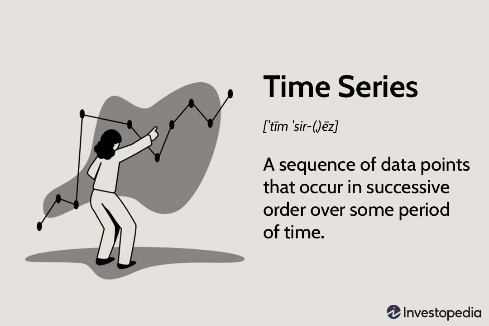

#### Languages:

#### Tech Stack:

<!--

  
 
  

-->

### Hi there 👋 This is Cheting Meng's GIthub.

### About me
&nbsp;&nbsp;&nbsp;&nbsp;&nbsp;&nbsp;
Greetings! My name is Che-ting Meng, you can call me Dakota. I finished my bachelors degree in Civil Engineering. Along with my training in becoming a civil engineer, I have always felt a passion for analyzing the numbers and data, and that I have a talent mathematics and quantitative methods. After winning a national undergradute research award by performing data analysis on the energy consumption simulations, I was certain of my passion in analyzing and working with data.
 &nbsp;&nbsp;&nbsp;&nbsp;&nbsp;&nbsp;
That is why I am currently pursuing a dual masters degree at Georgia Tech majoring in Computaitonal Science and Engineering. I am especially interested and devoted myself in machine learning algorithms numerical analysis, and I look forward to deploying them in a professional setting and the field of engineering.
### My Expertise
- Statistical Modeling
  -  Hidden Markov Models, Density Estimation, Kernel Methods, Bootstrapping, etc.
- Machine Learning
  - Classification: KNN, SVM, Logistic Regression, etc.
  - Regression: Gradient Boosted Regression, Linear Regression, Gaussian mixture models, etc.
  - Dimensionality Reduction: PCA, t-SNE, Autoencoder, Isomap, etc.
- NLP
  -  Word2Vec, NLU, NLG, Attention Mechanism, Transformer, LLM, etc.
- Computer Vision
  -  Object Detection, Instance Segmentation, etc.

### My Projects
Amazon Dissatisfaction Prediction | DL Web Application | Time Series Analysis | Writing Quality Prediction
-------------- | ----------------- | -------------------- | ---------------------
Modeling user-product relations with Transformer initialized tripartite Graph Convolutional Network. | Vaccination adverse effect deep learning prediction presented on Flask & JS.D3 frontend. | Multivariate & statistical analysis on NYC crime tiem series data. | Input logs Transformer seq-to-seq embedded writing quality predictor.
👉 [Repo](https://github.com/PsyDak-Meng/Amazon-Dissatisfaction-Prediction) | 👉 [Repo](https://github.com/PsyDak-Meng/VAE_Insight) | 👉 [Repo](https://www.creative-tim.com/product/soft-ui-react-native) | 👉 [Repo](https://github.com/PsyDak-Meng/Writing_P2Q)

<!--
✅ [Code Walkthrough](https://demos.creative-tim.com/material-kit/index.html) | ✅ [Code Walkthrough](https://demos.creative-tim.com/soft-ui-dashboard/pages/dashboard.html) | ✅ [Code Walkthrough](https://demos.creative-tim.com/soft-ui-react-native/) | ✅ [Code Walkthrough](https://www.creative-tim.com/learning-lab/tailwind-starter-kit/presentation)
 |  | | 
-->

## Contact me

)   

<!--
**PsyDak-Meng/PsyDak-Meng** is a ✨ _special_ ✨ repository because its `README.md` (this file) appears on your GitHub profile.

Here are some ideas to get you started:

- 🔭 I’m currently working on ...
- 🌱 I’m currently learning ...
- 👯 I’m looking to collaborate on ...
- 🤔 I’m looking for help with ...
- 💬 Ask me about ...
- 📫 How to reach me: ...
- 😄 Pronouns: ...
- ⚡ Fun fact: ...
-->
