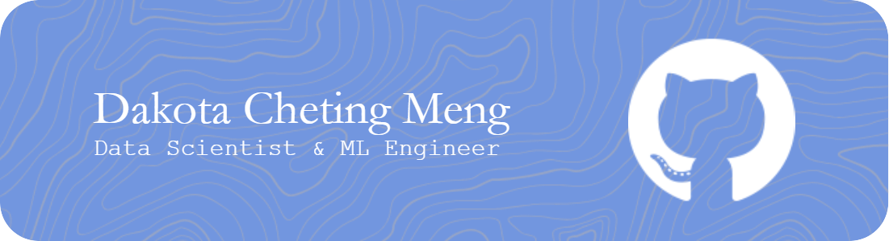
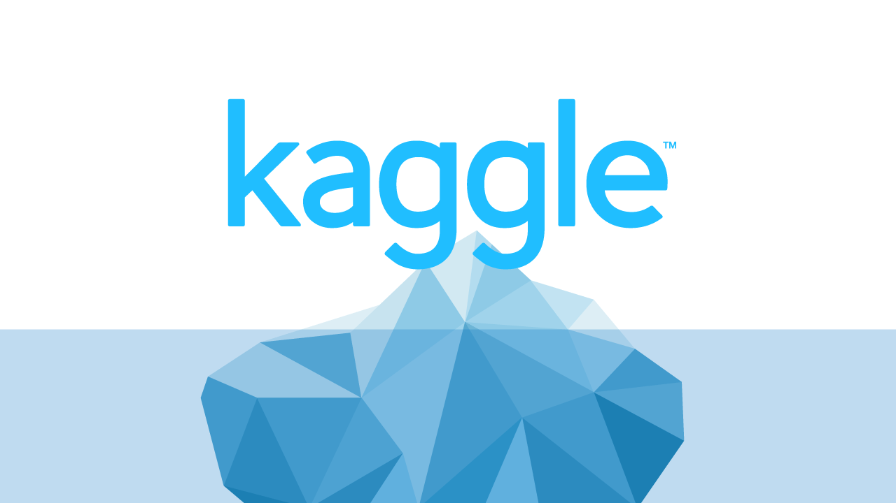

<!--  -->
### 👋 Greetings~ You've found the Github of Cheting Meng

      

#### Languages:

#### Tech Stack:

### About me
&nbsp;&nbsp;&nbsp;&nbsp;&nbsp;&nbsp;
I'm Cheting Meng, call me Dakota. I finished my bachelors in Civil Engineering. While studying engineering, I always felt a passion for data & modeling, and that I have a talent in mathematics and quantitative methods. After winning a national undergradute research award performing data analysis on the energy consumption simulations, I was certain of my passion in working with data.
 &nbsp;&nbsp;&nbsp;&nbsp;&nbsp;&nbsp;
So, now I'm pursuing a dual Masters degree at Georgia Tech in Computaitonal Science and Engineering. I am especially dedicated in machine learning algorithms and applications. I look forward to deploying them in a professional setting and the field of engineering.
### My Expertise
#### Statistical   Modeling | Machine Learning | NLP | Computer Vision

### My Projects
Amazon Dissatisfaction Prediction | DL Web Application | Inundation Traffic Simulation | Writing Quality Prediction
-------------- | ----------------- | -------------------- | ---------------------
Modeling user-product relations with Transformer initialized tripartite Graph Convolutional Network. | Vaccination adverse effect deep learning prediction presented on Flask & JS.D3 frontend. | Agent-based modeling for traffic simulation under flood distress. | Input logs Transformer seq-to-seq embedded writing quality predictor.
👉 [Repo](https://github.com/PsyDak-Meng/Amazon-Dissatisfaction-Prediction) | 👉 [Repo](https://github.com/PsyDak-Meng/VAE_Insight) | 👉 [Repo](https://github.com/PsyDak-Meng/Inundation_Traffic_Simulation) | 👉 [Repo](https://github.com/PsyDak-Meng/Writing_P2Q) 
 |  | | 

<!--
✅ [Code Walkthrough](https://demos.creative-tim.com/material-kit/index.html) | ✅ [Code Walkthrough](https://demos.creative-tim.com/soft-ui-dashboard/pages/dashboard.html) | ✅ [Code Walkthrough](https://demos.creative-tim.com/soft-ui-react-native/) | ✅ [Code Walkthrough](https://www.creative-tim.com/learning-lab/tailwind-starter-kit/presentation)
 |  | | 
-->

## Contact me

  ) 

<!--
**PsyDak-Meng/PsyDak-Meng** is a ✨ _special_ ✨ repository because its `README.md` (this file) appears on your GitHub profile.

Here are some ideas to get you started:

- 🔭 I’m currently working on ...
- 🌱 I’m currently learning ...
- 👯 I’m looking to collaborate on ...
- 🤔 I’m looking for help with ...
- 💬 Ask me about ...
- 📫 How to reach me: ...
- 😄 Pronouns: ...
- ⚡ Fun fact: ...
-->
